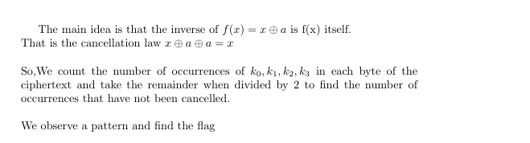

```python
from Crypto.Util.number import *
def print_scheme():
    ct = [{i: 0 for i in range(5)} for _ in range(32)]
    keys = 5
    offset = 0
    for _ in range(5):
        for i in range(32):
            ct[i][offset] = (1 + ct[i][offset])%2
            for j in range(keys):
                if i & 2**j: ct[i][j+offset] = (1 + ct[i][j+offset])%2
        keys -= 1
        offset += 1
    for i in range(len(ct)):
        s = f'ct{i} = pt{i}'
        for j in ct[i].keys():
            if ct[i][j]: s += f' ^ k{j}'
        ct[i] = s
    ct = '\n'.join(ct)
    print(ct)

pt = 69837538996696154134353592503427759134303178119205313290251367614441787869767
ct = [153, 102, 39, 242, 39, 149, 117, 232, 221, 111, 183, 6, 70, 46, 4, 222, 85, 178, 233, 81, 4, 186, 240, 74, 238, 81, 27, 83, 14, 154, 143, 1]
pt=long_to_bytes(pt)

key = [0 for _ in range(5)]
key[0] = pt[2] ^ ct[2]
key[1] = pt[7] ^ ct[7]
key[2] = pt[13] ^ ct[13]
key[3] = pt[25] ^ ct[25]
key[4] = pt[17] ^ ct[17]

c = 9803360482107840935986732378323704110929708112302712803731012575465683179961905078466611828488789490543493731143558620545390953556032902554822421856356533539501430684361482576102587663520949056746659748698357755897924885992782747151219465028805502494393787119343428804346092071091528754744212809617351149272272380807238804504647510591726329582179077324427249076164587445605982981728078911123292553075494650141966258672901488344682939222675606336207847496023541310374013054536034137315183694024407951884904209160042408478973616348037614424915600220818790089801126821003600059671390406058169258661700548713247796139155
p = 95237125230167487838272944166423714051165223593288401382688685829040590786990768778438234082000903807362777558583037575230881045249425322887376601259055892460702772000162982010970208724929645212521533513649369206757681770172577467721506667626730799406015091008310940052579697065207083389866466950134622798087
q = 124379800279519757231453952571634329234726580565504345524807447690769923505626825913853213968267033307369831541137813374478821479720151365039955869403139958659415082657593784893960018420207872886098820339882222586464425407525431977262528398209506069668083100281117639890041468740215875574081639292225496987247
e = bytes_to_long(bytes(key))
d = pow(e,-1,(p-1)*(q-1))

msg = pow(c, d, p*q)
msg = long_to_bytes(msg).decode()

print_scheme()
print(msg)
```
