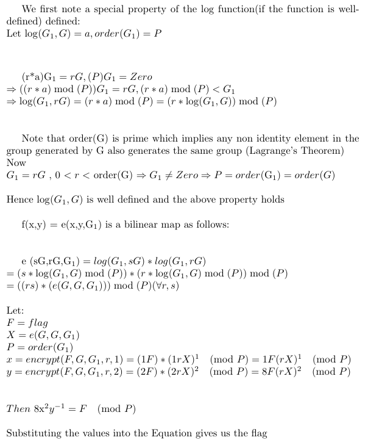

```python
from Crypto.Util.number import *
P=9838948139383914190266949186227508456237422773389139731477438980612244639396986459702784022182259517825178961882460281894435624191429361507733141410108353
x=9610589311851313337353167649275980384547956027651711488306548228369734729984764259169549526553914663235399604831818905488559538219771647195817790678307028
y=1462252779857426930386804474349238224526658533023314567285752520760599353071161037369090958271942675083207072974692226137748592329746284467081387354827155
flag=(8*pow(x,2,P)*pow(y,-1,P))%P
print(long_to_bytes(flag).decode())
```
