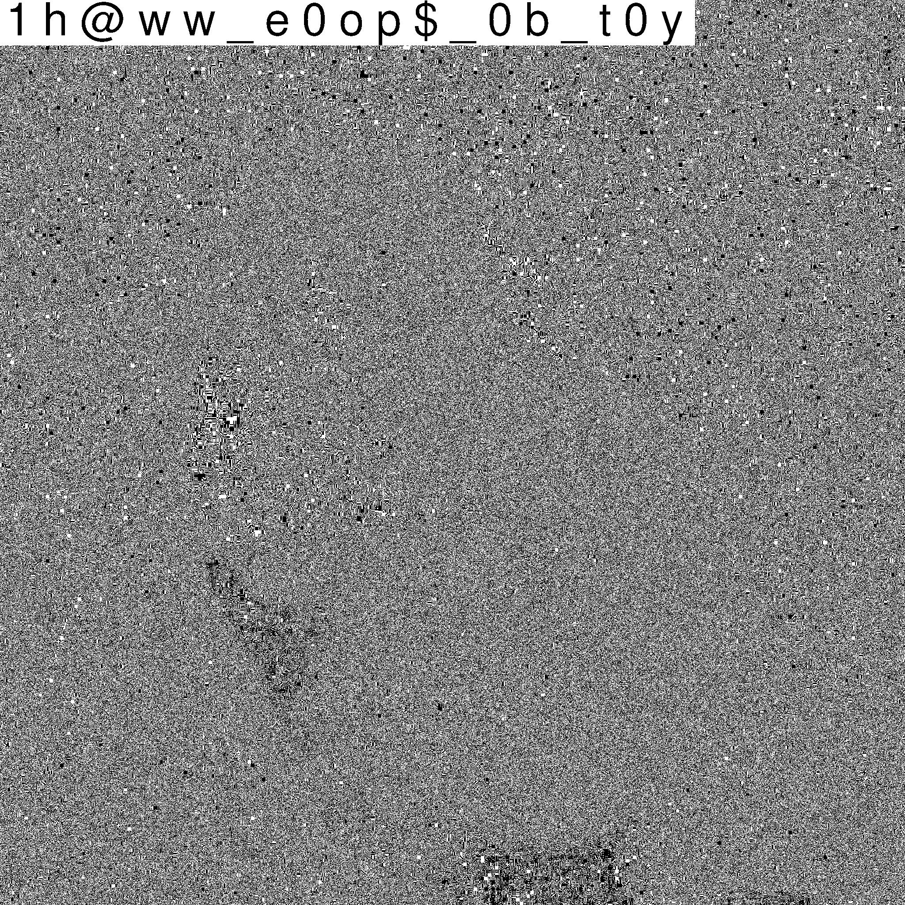
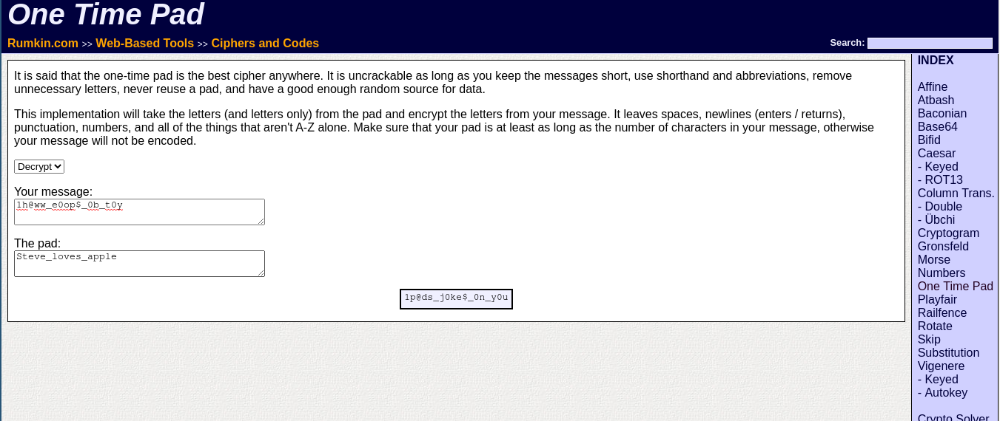

# Pragyan CTF 2022: Marcel and the iPad.


> Find and submit the p_ctf{flag}
>
> 

## Write-up
1. Using exiftool on the image, you can see the metadata of the image which has


```
$ exiftool marcel.png 
ExifTool Version Number         : 12.30
File Name                       : marcel.png
Directory                       : .
File Size                       : 4.2 MiB
File Modification Date/Time     : 2022:02:14 17:16:50+05:30
File Access Date/Time           : 2022:02:14 17:16:51+05:30
File Inode Change Date/Time     : 2022:02:14 17:16:50+05:30
File Permissions                : -rw-r--r--
File Type                       : PNG
File Type Extension             : png
MIME Type                       : image/png
Image Width                     : 2048
Image Height                    : 2048
Bit Depth                       : 8
Color Type                      : RGB with Alpha
Compression                     : Deflate/Inflate
Filter                          : Adaptive
Interlace                       : Noninterlaced
SRGB Rendering                  : Perceptual
Significant Bits                : 8 8 8 8
Comment                         : Steve_loves_apple
Image Size                      : 2048x2048
Megapixels                      : 4.2
```

You can notice there is a tag named comment which has a value `Steve_loves_apple`, which clearly isn't the hint marcel wants to provide.

2. Now using some stegnography tool like stegsolve, you can find out that there is a hidden text in the image file.



which says `1h@ww_e0op$_0b_t0y`. This isn't the flag either apparently.

You can also use this online [steg tool](https://incoherency.co.uk/image-steganography/#unhide)

3. Now as the question title and the description emphasizes over iPad. It is related to One time pad which can easily be figured out online. You can use any online tool to decode the flag here.

Now as we clearly have two different texts `Steve_loves_apple` and `1h@ww_e0op$_0b_t0y`

You can use some online tool like [One time pad](http://rumkin.com/tools/cipher/otp.php)



Using this tool we can figure out the final flag to be `1p@ds_j0ke$_0n_y0u`

So the final flag is `p_ctf{1p@ds_j0ke$_0n_y0u}`
