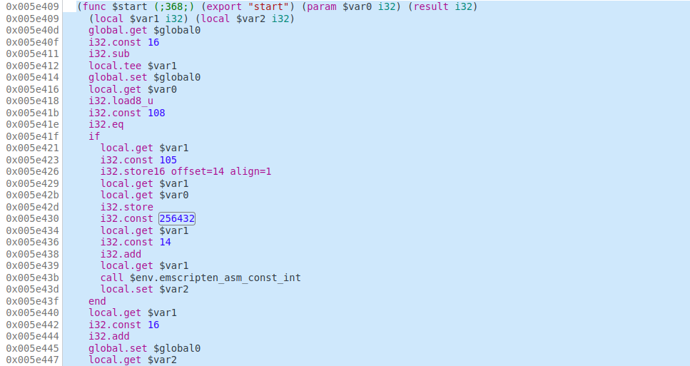
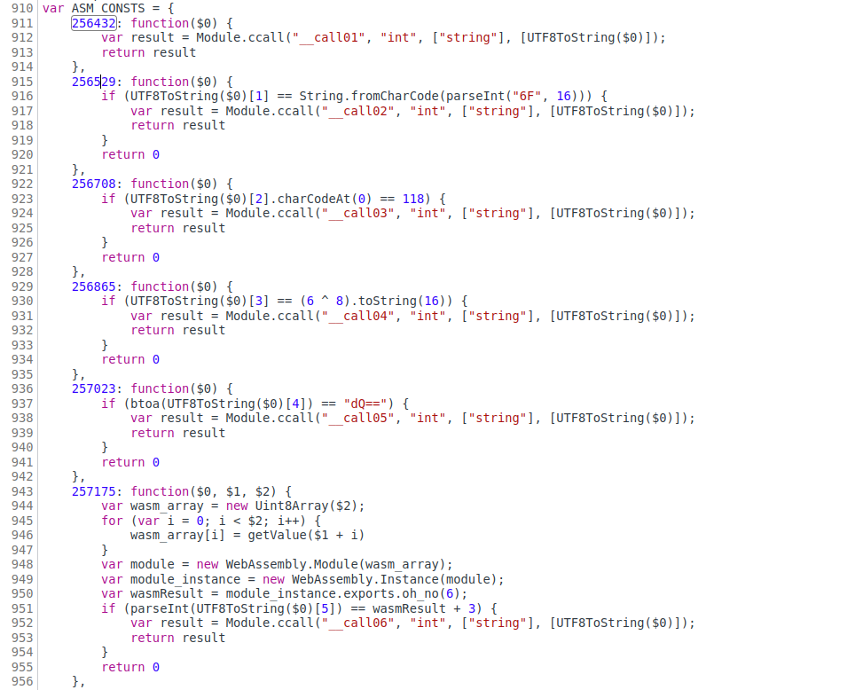
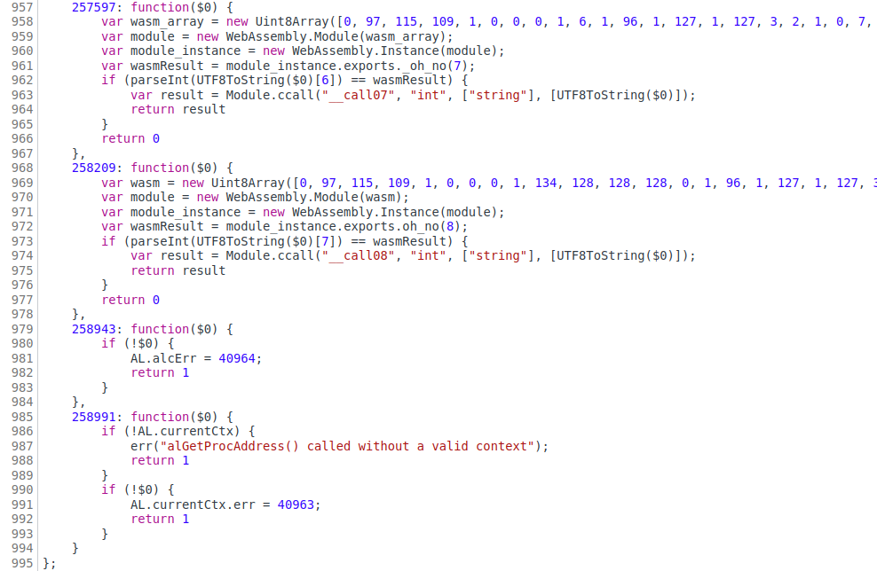
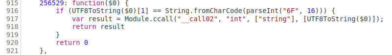

# Pragyan CTF 2022: Feb14_Special

## Write-Up

1) This challenge is a web assembly challenge, which contains pretty big javascript and wasm file. For solving this we will be making use of the browser developer debugging feature. 

2) But when we have a close look into the javascript code inside script tag of the index.html file, we can able to find that the first C function called named as "start", in which the input text is being passed.

3) On searching for the "start" function in wasm file, was can get that function along with the consecutive C functions

```
 __call01, __call02, __call03, __call04, __call05, __call06, __call07, __call08.
 ```



4) By checking the ASM_CONSTS for those all 9 functions in index.js we will endup by knowing the exact processing of the input text and how they are being validated.





5) In that index.js file you can find that all those functions are evaluating a single char and calling the next function, if the check is passed.

6) Example, the below shown function check for the 2nd character of the input string by comparing the hex value of o. So, basically this shows that the 2nd character of correct text is o.



7) On reversing further in the similar manner you will get the correct text to be,
```
loveu3000
```

## Alternative solution:

1) On thinking, how the final flag will be displayed after entering the correct text we will get the flag in a much more easier way.

2) So, on going through the wasm file we will find the most evil and harmful function, which is eval(). And you can notice that there is some base64 encoding text is there. 

3) On decoding you will end by getting the flag inside an alert function.

## The flag is 
```
p_ctf{w3b_a223mb1y_w1ll_b3_th3_fu4tur3}
```