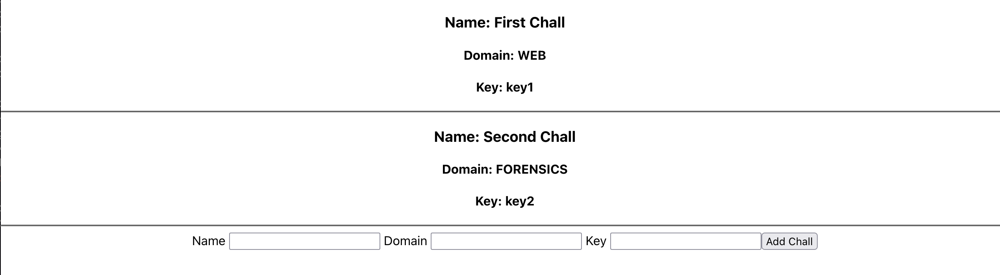
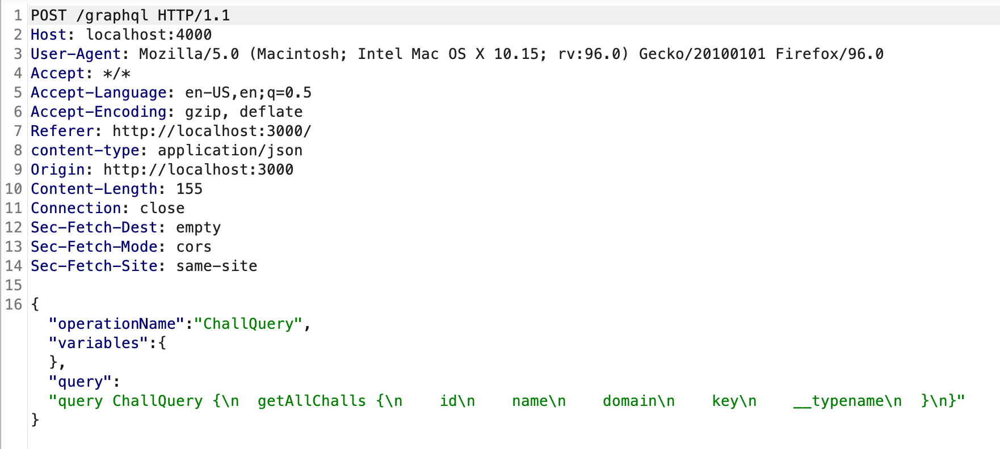
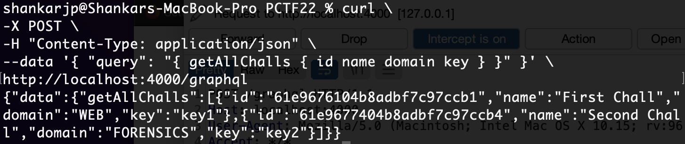
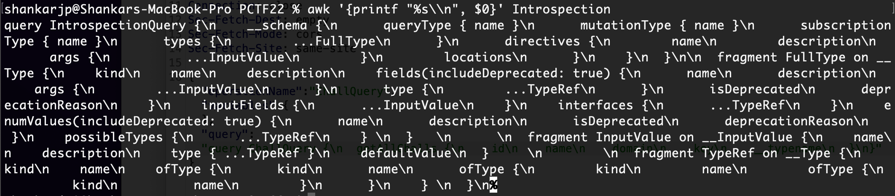
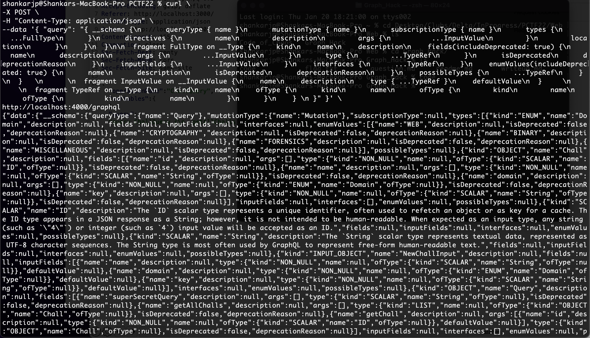
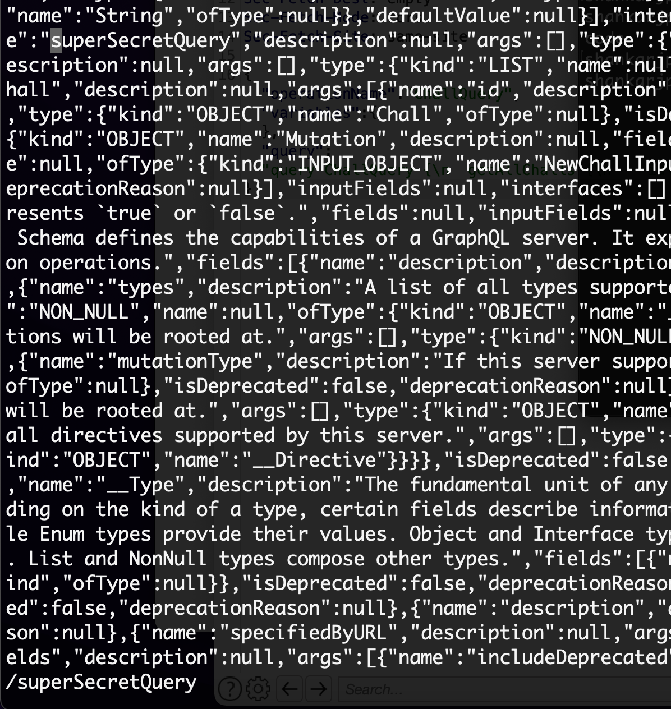
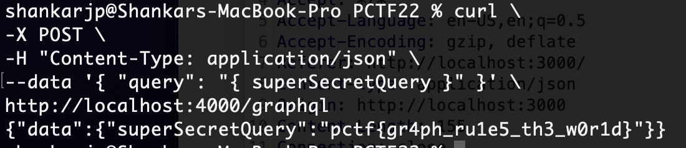

# Pragyan CTF 2022: GraphHack
## WriteUp
When exploring the website, the homepage displays the name, domain and keys of challenges. Form for adding new challenges is given.


- On Intercepting the requests made by the site using tools like BurpSuite, it leads us to a graphql endpoint running on port 4000.


- Making Queries to the same endpoint, gives us the similar response as the frontend.


- Perform a GraphQL Introspection by sending a full request on the target, which will return the full schema of the server, including queries, mutations, objects, etc.
A Sample query is given below.
```
query IntrospectionQuery {
    __schema {
      queryType { name }
      mutationType { name }
      subscriptionType { name }
      types {
        ...FullType
      }
      directives {
        name
        description
        args {
          ...InputValue
        }
        locations
      }
    }
  }

  fragment FullType on __Type {
    kind
    name
    description
    fields(includeDeprecated: true) {
      name
      description
      args {
        ...InputValue
      }
      type {
        ...TypeRef
      }
      isDeprecated
      deprecationReason
    }
    inputFields {
      ...InputValue
    }
    interfaces {
      ...TypeRef
    }
    enumValues(includeDeprecated: true) {
      name
      description
      isDeprecated
      deprecationReason
    }
    possibleTypes {
      ...TypeRef
    } 
  }   
      
  fragment InputValue on __InputValue {
    name
    description
    type { ...TypeRef }
    defaultValue
  }     
        
  fragment TypeRef on __Type {
    kind
    name
    ofType {
      kind
      name
      ofType {
        kind
        name
        ofType {
          kind
          name
        }
      }
    } 
  }     
```


- Searching through the response for suspicious phrases, we get the following clue.

Making the following query gives the flag for the challenge.


Flag for the above challenge: 
```
pctf{gr4ph_ru1e5_th3_w0r1d}
```