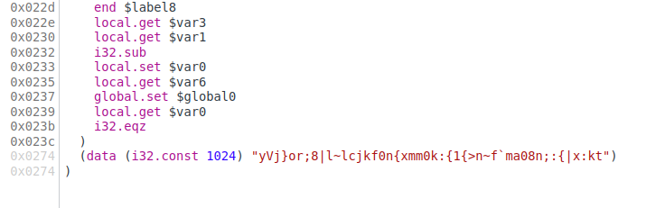
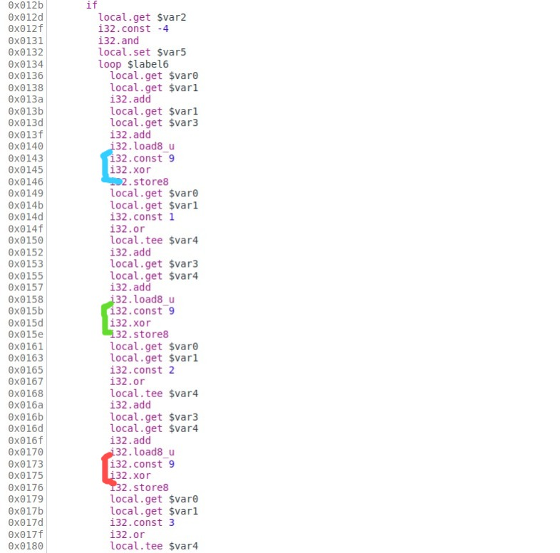
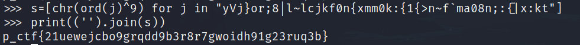

# Pragyan CTF 2022: Web_Awesome

## Write-Up

1) This is also a web assembly challenge. But here, there is no shotcuts as the previous challenge.

2) On going through the index.wasm file using the browser developer feature, we will find that only one long function which takes users input and also at the end, it has some weird strings passed and being compared.



3) On looking bit deep into that function, we can find a loop and XOR of 9 is being  processed with the input characters.



4) From this we can infer that the XOR of 9 with the flag characters is that weired string which was found in the last of wasm file.

5) So on decoding that, we get the flag.




## The flag is
```
p_ctf{21uewejcbo9grqdd9b3r8r7gwoidh91g23ruq3b}
```